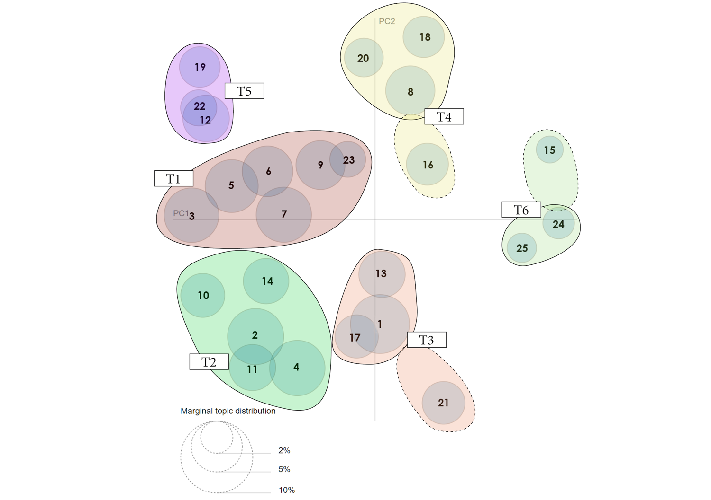

# Student-Voices
Analyze teacher reviews from every English speaking country. We scraped millions of reviews from students and parents and then analyzed them using all sorts of neat natural language processing techniques based on the gensim module. 

This serves as the repository for a series of publications studying the perceptions of teachers in the U.S. We will update the repo with relevant publication information as these are available. In the meantime, enjoy :) 

## The Scraper 

The `rmt_scraper` class is designed to scrape millions of reviews submitted from almost every english speaking country in the world. It can execute single or multi-threaded scraping. It uses selenium a combination of selenium and beautiful soup to: 

1) navigate each geographic level collecting the relevant links for each geography contained within from country to school. 
2) scrape school level information and teacher specific ratings links from each school page. 
3) scrape teacher descriptions and reviews from each teacher link. 

Each review scraped included the text of the review submitted, likert scale responses for a number of qualities, and a numeric rating from 1 to 5 (in steps of 0.5) which we later scaled from 0 to 100. 

The scraper can be executed from notebook `(A1) scrape_database`. Basic and detailed summary statistics can be found in notebooks `(A2) explore_clean_setup` and `(A3) teacher_stats` respectively. We used [`git large file storage`](https://git-lfs.github.com/) to store larger files. The number of reviews changes over time, at the time of our scraping we collected 4,863,978
reviews. 

## The Subjects of Bad Reviews Using LDA

In the first commit to this repo we uplodaed an analysis of reviews that rated teachers from 0 to 35 out of 100. This sub-corpus included 359,387 total reviews. We experimented with a number of different cleaning processes and model parameters, before settling on 4 viable candidate parameters for an in depth experimental trial. Some critical findings in early stage tweeking was the importance of setting a minimum review length and incorporating bigram & ngram phrase detection.

To analyze these reviews we experimented using LDA model available through the [`gensim`](https://radimrehurek.com/gensim/index.html) python package. We created a number of personalized visualizations, we also created visualizations using the [`pyLDAvis`](https://pypi.org/project/pyLDAvis/) plug-in for gensim. The results from this analysis are summarized in the "General Conclusions" section of the `(B2) lda_results_0-35` notebook. 

## Notebooks 

The notebooks can be used to run the different stages of the project. Notation: the letter indicates the phase of the project that is being run (i.e. data collection, LDA analysis, language modeling, etc...) and the number indicates the dependency level within the phase. This is only true across phases if the numbering of a given phase does not include earlier numbers. Thus, A1 generates materials necessary for A2, A2 -> A3 & B3, B3 -> B4, but A3 is not needed for B4.  

**(A1) scrape_database.ipynb**: scrapes all or a subset of teachers reviews and stores them in a series of pickle files. 
**(A2) explore_clean_setup.ipynb**: imports, appends, splits the data into quantitative and text datasets, generates different cleaned versions of the text, provides summary statistics.
**(A3) teacher_stats.ipynb**: a more in depth look at the quantitative side of the data. 
**(B3) lda_topics.ipynb**: initial exploration of potential LDA experimentation strategies and execution of a 4-trial lda experiment. 
**(B4) lda_results_0-35.ipynb**: reviews of LDA outcomes for the 0-35 rated sub-corpus of the entire body of reviews. (Note: this notebook will note render properly on github, to view it fully rendered visit it using nbviewer [here](https://nbviewer.jupyter.org/github/dankundertone/Student-Voices/blob/master/%28B4%29%20lda_results_0-35.ipynb) 
